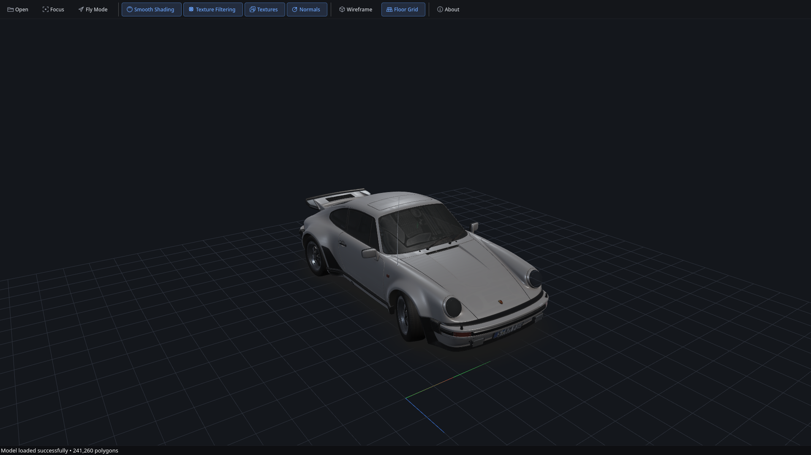
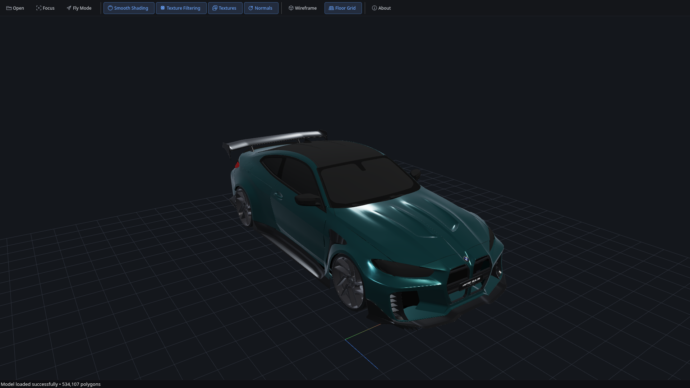
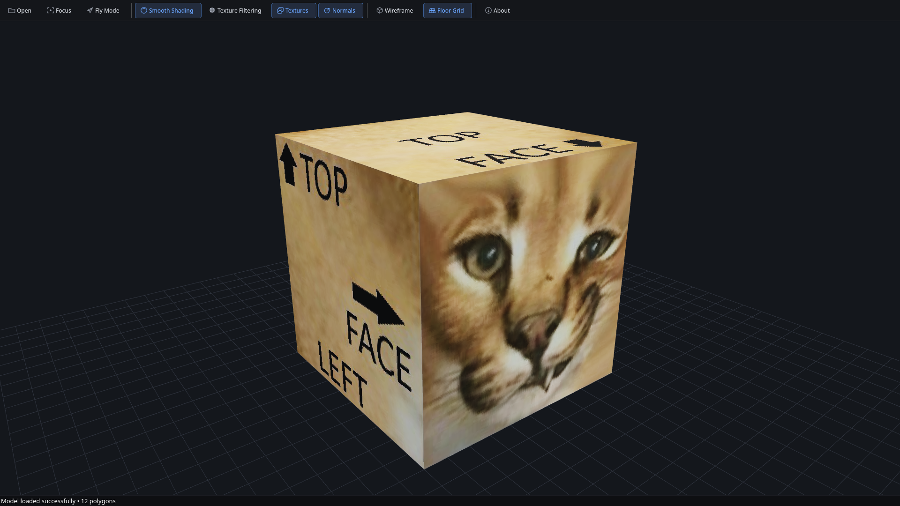

*[🇷🇺 Читать на русском / Read in Russian](README_RU.md)*

# 🧊 Studio 3D Viewer

| 🚗 Porsche (glTF PBR) | 🏎️ BMW M4 (OBJ Metallic) | 🐱 Floppa (Pixel-Art) |
| :---: | :---: | :---: |
|  |  |  |


**Studio 3D Viewer** is a professional, lightweight, and mathematically strict 3D model inspection tool. The project was built with a focus on pure computer graphics architecture, clean code, and uncompromising adherence to industry standards (Khronos glTF 2.0 and Alias|Wavefront).

The engine is written in **C++17**, utilizing hardware-accelerated **OpenGL** via an interleaved VBO/VAO pipeline. It features a True PBR (Physically Based Rendering) lighting model, linear color space workflow, and a fully autonomous "Zero-Asset" deployment structure.

---

## ✨ Key Features

*   **Hardware-Accelerated Core:** Zero CPU draw loops. Geometry is packed into contiguous 48-byte interleaved buffers and rendered with high-efficiency indexed drawing via `glDrawElements` (EBO).
*   **True PBR Shading:** 
    *   Physically accurate Roughness and Metallic evaluation.
    *   Energy conservation equations (diminishing diffuse light as specular reflection increases).
    *   Schlick's Fresnel approximations and studio softbox reflections.
*   **Direct Perceptual Color Pipeline:** Linear color space conversion on load, combined with hardware 2.2 Gamma compensation on output to prevent color bleaching and crushed shadows.
*   **Dual Camera System:**
    *   `Orbit Camera` — standard turntable inspection.
    *   `FPS Fly Mode` — 6-DOF WASD free-flight camera with mouse tracking to seamlessly explore vehicle interiors or large scenes.
*   **Professional Inspection Tools:**
    *   `Clay Mode` — temporarily hides textures and transparent elements, rendering a smooth studio clay material (`MatCap`) for topology evaluation.
    *   `Smooth / Flat Shading` — real-time toggling using screen-space geometric derivatives (`dFdx`/`dFdy`) without rebuilding the mesh on the CPU.
    *   `Texture Filtering` — automatic standard compliance. Sharp `GL_NEAREST` point-filtering for pixel-art (Minecraft/Blockbench), and `GL_LINEAR_MIPMAP_LINEAR` for HD assets.
*   **Asynchronous Multithreading:** Heavy file I/O, mesh parsing, and texture decompression are offloaded to background threads (`QtConcurrent` + `QThread`), keeping the GUI 100% responsive.
*   **Zero-Asset UI Engine:** The core interface requires no external bitmaps. All toolbar icons and inspection UI elements are resolution-independent vectors generated programmatically via `QPainterPath`, enabling seamless standalone binary compilation.
*   **Native & Bilingual:** High-performance native Qt6 application. The interface automatically adapts to English or Russian based on your OS locale.

---

## 🚀 Supported Formats & Specifications

1.  **glTF 2.0 / GLB (The Modern Standard)**
    *   Full parsing of hierarchical Scene Graphs and transformation matrices.
    *   Full PBR material stack: extracts `baseColorFactor`, `roughnessFactor`, `metallicFactor`, emissive radiance, ambient occlusion, and `KHR_materials_transmission` (automotive glass).
    *   Reads JSON `samplers` specification to automatically apply correct texture filtering.
2.  **Wavefront OBJ + MTL (The Classic Standard)**
    *   Arbitrary n-gon fan triangulation.
    *   Auto-generation of area-weighted smooth normals via cross-products and direct vector accumulation.
    *   Supports classic specular exponent `Ns` to Roughness conversion, as well as modern PBR extensions (`Pr`, `Pm`).

---

## 🛠️ Build and Installation

### 🐧 Build on Linux (Arch Linux / Manjaro)

1. Install the necessary dependencies (compiler, CMake, Qt6):
   ```bash
   sudo pacman -S base-devel cmake qt6-base mesa
   ```
2. Clone the repository and run the build script:
   ```bash
   git clone https://github.com/Arta48/Studio-3D-Viewer.git
   cd Studio3DViewer
   ```
3. Compile and run:
```bash
sh compile.sh
./build/Studio3DViewer
```

### 🪟 Build on Windows

The project includes a script for a fully automated build of an independent `.exe` file that does not require pre-configuring the environment.

1. Run the `compile.bat` file (by double-clicking or via the console).
2. The script will do everything for you:
   * Download and install the **MSYS2** environment (into `C:\msys64`).
   * Download the GCC compiler, CMake, and a static version of Qt6 with all dependencies.
   * Configure and compile the project.
3. The compiled `Studio3DViewer.exe` file will be located in the `build-windows/` directory.

*💡 Note: To completely clean the system from the build environment after compilation is finished, you can simply delete the `C:\msys64` folder.*

### 🐧 Cross-compilation for Windows (from Linux)

The project supports building a static `.exe` file for Windows directly from Linux via MinGW cross-compilation.

1. Install MinGW and add the `ownstuff` repositories:
   ```bash
   sudo pacman -S mingw-w64-gcc
   
   if ! grep -q "ownstuff" /etc/pacman.conf; then
       echo -e "
   [ownstuff]
   SigLevel = Optional TrustAll
   Server = https://ftp.f3l.de/~martchus/\$repo/os/\$arch
   Server = https://martchus.dyn.f3l.de/repo/arch/\$repo/os/\$arch" | sudo tee -a /etc/pacman.conf > /dev/null
   fi
   
   sudo pacman-key --keyserver keyserver.ubuntu.com --recv-keys B9E36A7275FC61B464B67907E06FE8F53CDC6A4C
   sudo pacman-key --finger B9E36A7275FC61B464B67907E06FE8F53CDC6A4C
   sudo pacman-key --lsign-key B9E36A7275FC61B464B67907E06FE8F53CDC6A4C
   
   sudo pacman -Syy
   sudo pacman -S mingw-w64-cmake mingw-w64-qt6-base-static
   ```
2. Run the build script for Windows:
   ```bash
   sh compile_windows.sh
   ```
3. The compiled `Studio3DViewer.exe` file will be located in the `build-windows/` directory.

---

## 📁 Project Structure

*   `src/` — C++ source code (engine, PBR shaders, OBJ/glTF loaders, GUI).
*   `assets/` — visual resources (icons).
*   `CMakeLists.txt` — build system configuration.
